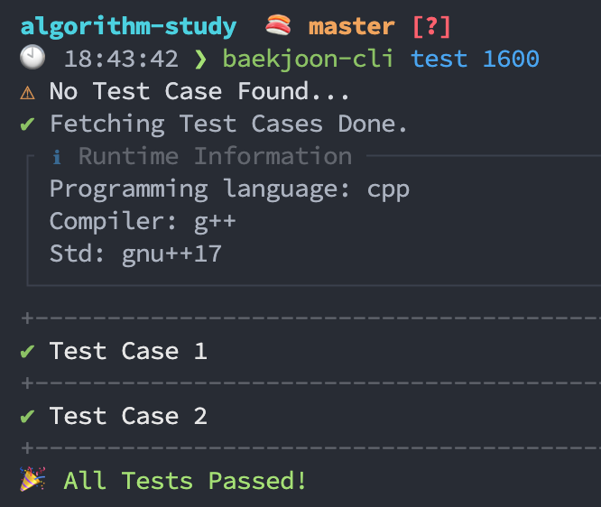

# baekjoon-cli-util

Simple code runner and CLI tool for studying, testing and managing [Baekjoon](https://www.acmicpc.net/) algorithm source codes efficiently. Cross-platform.

* Just run your single algorithm source code regardless of your language details (compiler, cli command tools... etc).
* Create the source code through code template by programming language.
* Download and run all tests at once, and add the test you need manually.
* Use automatic commit convention through commit template.



Disclaimer:

* This program doesn't handle [Special-Judge problems](https://help.acmicpc.net/judge/info) properly.

## Install

1. Install the program through `npm`.

```
$ npm i -g baekjoon-cli-util
```

2. Move into your project's root. (where the `.git` folder exists)

3. Configure a programming language and code template.

```
$ baekjoon-cli config lang
$ baekjoon-cli config code-template
```

## Usage

```
Commands
  create		Create the problem source code on the subdirectory, and fetch tests.
  test			Find, compile and run a problem source code.
  add-test		Add additional test manually by code editor.
  edit-test		Edit test manually by code editor.
  clear-test	Clear the specified problem's test.
  clear-tests	Clear all the problem's tests.
  view-tests	Check the problem's tests.
  open			Open the problem's URL in your browser.
  commit		Commit the problem source code to Git.
  config		Check and update templates, configurations.

Usage
  $ baekjoon-cli [create <problem identifier>]
  $ baekjoon-cli [test <problem identifier>]
  $ baekjoon-cli [add-test <problem identifier>]
  $ baekjoon-cli [open <problem identifier>]
  $ baekjoon-cli [commit <problem identifier>]
  $ baekjoon-cli [clear-test <problem identifier> <test index>]
  $ baekjoon-cli [clear-tests <problem identifier>]
  $ baekjoon-cli [view-tests <problem identifier>]

Configs
  lang				Default programming language.
  timeout			A timeout value of test runner. Test runner exit the test if the running time is greater than this value.
  code-template		Code template used by `create`.
  commit-message	Commit message template used by `commit`.

Usage
  $ baekjoon-cli [config]
  $ baekjoon-cli [config lang <language>]
  $ baekjoon-cli [config timeout <ms>]
  $ baekjoon-cli [config code-template]
  $ baekjoon-cli [config commit-message]
```

## Supported languages

- [x] C++
- [x] C
- [x] Java
- [x] Node.js
- [x] Python
- [x] Go
- [x] Rust
- [x] Swift
- [x] Ruby
- [ ] Kotlin
- [ ] D

## Runtime configuration

By default, this program use below tools for running tests.

So, make sure the corresponding tool should be setup on your computer.

| Programming language | Compiler / Interpreter |
| -------------------- | --- |
| c                    | gcc |
| c++                  | g++ |
| go                   | go |
| java                 | javac |
| javascript           | node |
| python               | python3 |
| ruby                 | ruby |
| rust                 | rustc |
| swift                | swiftc |

You can change some test runner's configuration through creating `runner-settings.json` file to your working directory.

See also [runner's default configuration](./runner-settings.json).

## Source code template

You can create some code templates by your programming language.

This template file is used when you use `baekjoon-cli create`.

You can edit the template file through `baekjoon-cli config code-template`.

The `{variable}`s in the template are replaced with the according value.

| Variable | value |
| -------------------- | --- |
| id                   | Problem identifier |
| title                | Problem title |
| text                 | Problem texts |
| input                 | Problem input test |
| output                 | Problem output test |
| url                 | Problem url |
| date                 | File created date |

## Code editor setting

Some command requires executing your source code editor. You can change the editor to use by setting the `EDITOR` environment variable to what you want.

## Example

- [algorithm-study](https://github.com/jopemachine/algorithm-study)