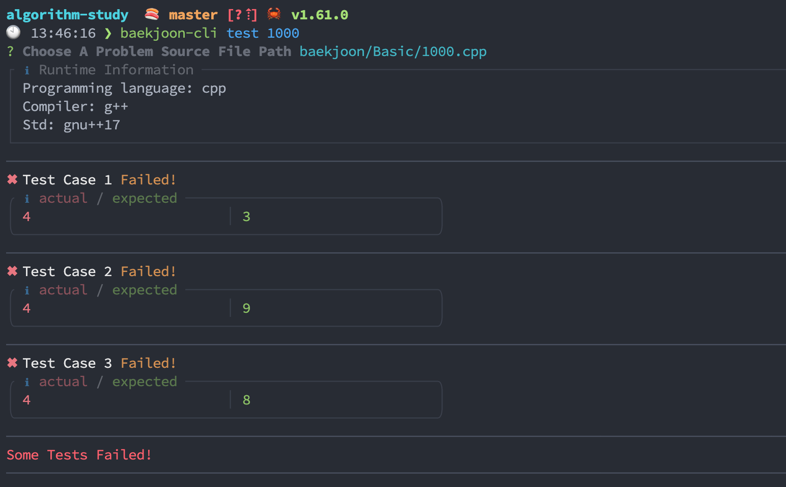
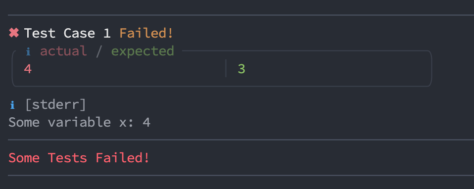
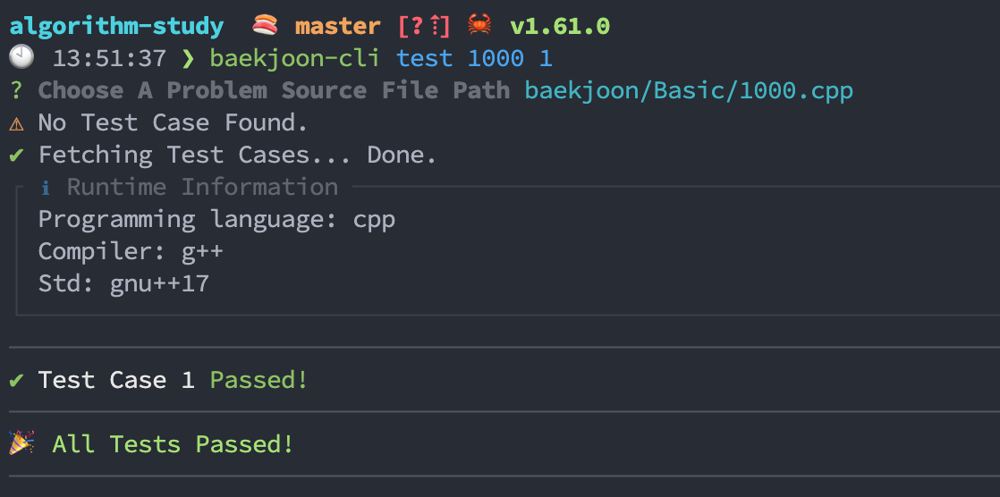

# baekjoon-cli-utils

[](http://badge.fury.io/js/baekjoon-cli-utils)
[](http://badge.fury.io/js/baekjoon-cli-utils)
[](https://lbesson.mit-license.org/)

> 코딩 테스트나 알고리즘 문제를 공부할 때, 풀었던 알고리즘 문제 풀이 과정을 좀 더 체계적으로 만들고, 관리할 수 있도록 만드는 것을 목표로 만든 CLI 도구입니다.

## 기능

* 소스 코드 파일을 만들 때 프로그래밍 언어에 따라 다른 템플릿 코드를 선택할 수 있습니다.


* 프로그래밍 언어에 사용되는 도구의 명령어들에 구애 받지 않고 한 번의 명령어 실행으로 여러 테스트들을 실행할 수 있습니다.



* 표준 출력, 표준 에러를 나누어 각각 예쁘게 출력합니다.



* 백준 서버에서 테스트들을 한 번에 내려 받을 수 있으며, 직접 테스트를 추가하거나 변경할 수 있습니다.



* Git에 소스 코드를 커밋할 때 간편하게 체계적인 커밋 메시지 컨벤션을 사용할 수 있습니다.

Disclaimer:

* 해당 프로그램은 [Special-Judge problems](https://help.acmicpc.net/judge/info)에 대해서 제대로 채점하지 못합니다.

## 설치

1. 아래 `npm` 명령어를 실행합니다.

```
$ npm i -g baekjoon-cli-utils
```

2. 프로젝트 루트 경로로 이동합니다 (`.git` 폴더가 존재하는 경로)

3. 아래 명령어로 사용할 프로그래밍 언어와 코드 템플릿을 설정합니다.

```
$ baekjoon-cli config lang
$ baekjoon-cli config code-template
```

## 사용법

```
$ baekjoon-cli --help

  Commands
    create / start  Create the problem source code on the subdirectory, and fetch tests.
    run / test      Find, compile and run a problem source code, and print test results in pretty format.
    add-test        Add additional test manually by code editor.
    edit-test       Edit test manually by code editor.
    rm-test         Clear the specified problem's test.
    rm-tests        Clear all the problem's tests.
    ls-tests      Print the problem's tests.
    open            Open the problem's URL in your browser.
    commit          Commit the problem source code to Git.
    push            Push the committed source code to Git.
    config          Check and update templates, configurations.

  Usage
    $ baekjoon-cli create <problem_identifier>
    $ baekjoon-cli run <problem_identifier>
    $ baekjoon-cli add-test <problem_identifier>
    $ baekjoon-cli edit-test <problem_identifier> <test_index>
    $ baekjoon-cli open <problem_identifier>
    $ baekjoon-cli commit <problem_identifier>
    $ baekjoon-cli rm-test <problem_identifier> <test_index>
    $ baekjoon-cli rm-tests <problem_identifier>
    $ baekjoon-cli ls-tests <problem_identifier>

  Configs
    show            Show current configurations.
    lang            Default programming language to use.
    timeout         A timeout value of test runner. Test runner exit the test if the running time is greater than this value.
    code-template   Code template used by \`create\`.
    commit-message  Commit message template used by \`commit\`.

  Usage
    $ baekjoon-cli config show
    $ baekjoon-cli config lang <language>
    $ baekjoon-cli config timeout <ms>
    $ baekjoon-cli config code-template
    $ baekjoon-cli config commit-message

  Options
    --raw           Print stdout in raw format in test runner.
                    It could be useful when you debug the source code with an infinity loop since test runner will not wait for the child process to exit.

  Flag Examples
    $ baekjoon-cli test --raw 1000
```

## 지원하는 프로그래밍 언어

- [x] C++
- [x] C
- [x] Java
- [x] Node.js
- [x] Python
- [x] Go
- [x] Rust
- [x] Swift
- [x] Ruby
- [ ] Kotlin
- [ ] D

## 런타임 설정

기본적으로, 해당 프로그램은 소스코드를 컴파일, 실행하기 위해 아래의 도구를 사용합니다.

따라서 아래 도구가 설치되어 있어야 합니다.

| Programming language | Compiler / Interpreter   |
| -------------------- | ------------------------ |
| c                    | `gcc`                    |
| c++                  | `g++`                    |
| go                   | `go`                     |
| java                 | `javac`                  |
| javascript           | `node`                   |
| python               | `python3`                |
| ruby                 | `ruby`                   |
| rust                 | `rustc`                  |
| swift                | `swiftc`                 |

위 런타임 설정을 변경하기 위해 `runner-settings.json` 파일을 만들 수 있습니다.

디폴트 파일은 아래와 같습니다.

## 소스 코드 템플릿

프로그래밍 언어 별로 코드 템플릿을 만들어 사용할 수 있습니다.

이 템플릿 파일은 `baekjoon-cli create` 명령어를 사용할 때 사용됩니다.

`baekjoon-cli config code-template` 명령어를 통해 현재 사용하는 언어의 코드 템플릿을 변경할 수 있습니다.

이 템플릿에서 아래 `{variable}` 매직 변수들은 오른쪽 값으로 대체됩니다.

| Variable             | value                  |
| -------------------- | ---------------------- |
| id                   | Problem identifier     |
| title                | Problem title          |
| text                 | Problem texts          |
| input                | Problem input test     |
| output               | Problem output test    |
| url                  | Problem url            |
| level                | Problem level          |
| tags                 | Problem tags           |
| date                 | File created date      |

예를 들어, {id}는 문제의 id 값으로 대체됩니다.

## Git 커밋 메세지 템플릿

`baekjoon-cli commit` 명령어를 사용할 때 사용됩니다.

이 템플릿에서 아래 `{variable}` 매직 변수들은 오른쪽 값으로 대체됩니다.

| Variable              | value                  |
| --------------------- | ---------------------- |
| id                    | Problem identifier     |
| title                 | Problem title          |
| url                   | Problem url            |
| level                 | Problem level          |
| date                  | File created date      |
| relativeDirectoryPath | Problem relative path  |

예를 들어, {id}는 문제의 id 값으로 대체됩니다.

## 코드 에디터 변경하기

몇몇 커맨드는 소스 코드 에디터의 실행을 필요로 합니다. 이 때 사용될 에디터는 `EDITOR`란 환경 변수의 값을 설정함으로써 변경하실 수 있습니다.

## Example

- [algorithm-study](https://github.com/jopemachine/algorithm-study)
